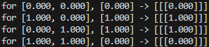

# Rust-Neural-Network

This is the beginning of a neural network library written in Rust, designed to provide a flexible and efficient platform for building and training simple neural networks.
The current implementation requires that everything is allocated on the heap and be computed in chunks. This will be changed once Rust has a better implementation of Generics in Constant Expressions.

> The nightly compiler is not something I wanna bother with.

## Why this library?

Since everything is written in rust and doesn't use any external dependencies, it can be easily integrated into any Embedded project without having to worry about speed or any dependance on other languages (which is my spacific use case)

## Project Status

This library is still in its early development stages, and the current version is in the beta stage and will jump to a 1.0.0 version once stack-based allocations are implemented.
Contributions and feedback are welcome, but please be aware that the internal structure may undergo significant changes as the library matures.

> It is highly recomended to use V7.0+ as I reworked the current algorithm to increase speed and negate any stochastic behavior resulting from some logical errors that were present.

## Features

- [x] Training: The library allows for low-level training of the network using backpropagation and gradient descent.
- [x] Activation functions (Sigmoid, Tanh, ArcTanh, Relu, LeakyRelu, SoftMax, SoftPlus, etc).
- [x] Model Serialization
- [ ] Stack-based allocations (coming soon)
- [ ] GPU acceleration (might be implemented in the future)

But, here's an example of creating a simple neural network and then training it for a number of epochs using the library

```rust
use fast_neural_network::{activation::*, neural_network::*};
use ndarray::*;

fn main() {
    let mut network = Network::new(2, 1, ActivationType::LeakyRelu, 0.01); // Create a new network with 2 inputs, 1 output, a LeakyRelu activation function, and a learning rate of 0.01

    network.add_hidden_layer_with_size(2); // Add a hidden layer with 2 neurons

    network.compile();  // Compile the network to prepare it for training
                        // (will be done automatically during training)
                        // The API is exposed so that the user can compile
                        // the network on a different thread before training if they want to

    // Let's create a dataset to represent the XOR function
    let mut dataset: Vec<(ndarray::Array1<f64>, ndarray::Array1<f64>)> = Vec::new();

    dataset.push((array!(0., 0.), array!(0.)));
    dataset.push((array!(1., 0.), array!(1.)));
    dataset.push((array!(0., 1.), array!(1.)));
    dataset.push((array!(1., 1.), array!(0.)));

    network.train(&dataset, 20_000, 1_000); // train the network for 20,000 epochs with a decay_time of 1,000 epochs

    let mut res;

    // Let's check the result
    for i in 0..dataset.len() {
        res = network.forward(&dataset[i].0);
        let d = &dataset[i];
        println!(
            "for [{:.3}, {:.3}], [{:.3}] -> [{:.3}]",
            d.0[0], d.0[1], d.1[0], res
        );
    }

    network.save("network.json"); // Save the model as a json to a file

    // Load the model from a json file using the below line
    // let mut loaded_network = Network::load("network.json");  
}
```

### Expected Output


## Speed

The focus of this library is multi-threaded performance. The library is designed to be as fast as possible, and I have done my best to optimize the code for performance. The library is still in its early stages, so there is still room for improvement, but I have done my best to make it as fast as possible. I just wish Rust had a better implementation of Generics in Constant Expressions like C++.

> Matrix parallelization is currently not implemented, but it will be once better generics are implemented in Rust.

## Contributing

Contributions are highly encouraged! If you're interested in adding new features, improving performance, fixing bugs, or enhancing documentation, I would appreciate your help. Just open a pull request and I'll look into it.

## Roadmap

The following features might be implemented in a future release:

- Support for more activation functions
- GPU acceleration using CUDA or similar technologies (probably just shaders but idk it seems hard)
- Enhanced model evaluation tools (and possibly, maybe even a GUI to go with them. If I write one it will be in Raylib btw)
